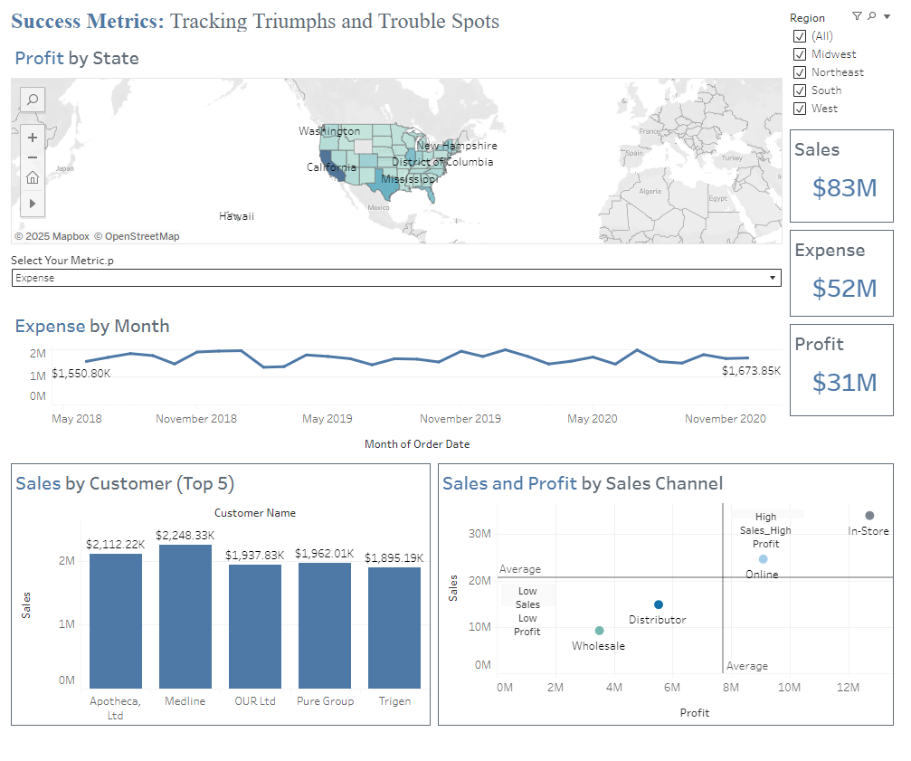

# 📊 Success Metrics: Tracking Triumphs and Trouble Spots

This Tableau dashboard provides an interactive, visual analysis of **sales**, **expenses**, and **profit** across the United States.  
It helps identify both high-performing regions and areas needing improvement, while providing insights into customer and sales channel performance.

---

## 🔍 Overview
The dashboard visualizes:
- **Profit by State** – Geographic view of profitability across U.S. states.
- **Expense by Month** – Time series of expenses for trend analysis.
- **Top 5 Customers by Sales** – Highlights key revenue-driving customers.
- **Sales & Profit by Sales Channel** – Shows performance quadrants for strategic decision-making.

---

## 📈 Key Metrics
- **Total Sales:** $83M  
- **Total Expenses:** $52M  
- **Total Profit:** $31M  

---

## 🗂 Features
1. **Interactive Geographic Map** – Drill into state-level profitability.
2. **Expense Trends Over Time** – Identify seasonal or long-term expense patterns.
3. **Customer Insights** – Focus on high-value clients.
4. **Channel Performance Analysis** – Compare online, in-store, wholesale, and distributor channels.

---

## 🛠 Tools & Technologies
- **Tableau Public** – Data visualization platform  
- **Mapbox** – Geospatial mapping  
- **Data Source:** (Add here if shareable)

---

## 📌 How to Use
1. Open the dashboard on **[Tableau Public](https://public.tableau.com/app/profile/dana.brooks6845/viz/SalesTablesDashboardandStory/SalesStory)**.
2. Use the **Region filter** to adjust the view.
3. Hover over data points for more detail.
4. Switch between metrics (Sales, Expense, Profit) to explore different perspectives.

---

## 📷 Preview

---

## 📜 Attribution
Dashboard created by **Dana Brooks** – *Success Metrics: Tracking Triumphs and Trouble Spots*  
If you use or adapt this dashboard, please credit:  
> “Original dashboard by Dana Brooks – available on Tableau Public.”

---

## 📄 License
This project is for educational and demonstration purposes only.
